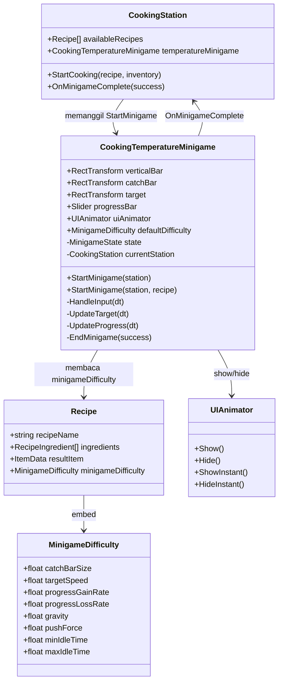
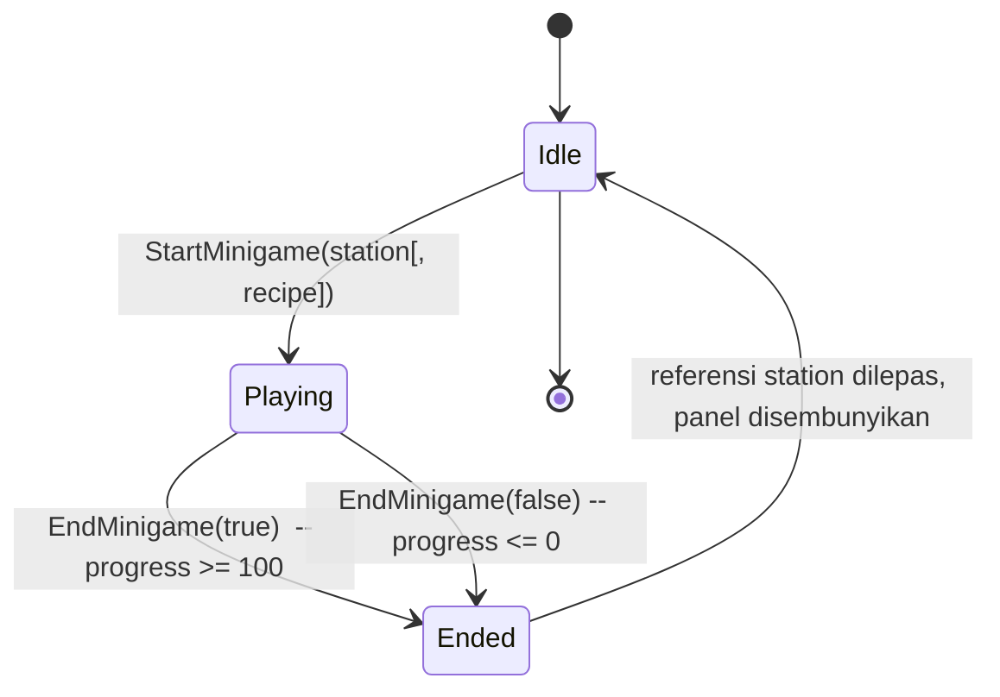

# Design Document — Fishing Cooking Minigame

## Overview

Dokumen ini merancang penggantian isi `CookingTemperatureMinigame.cs` dari minigame "shakey-wakey + suhu" lama menjadi minigame mancing bergaya Stardew Valley yang berjalan di UI Unity.

Pemain mengontrol sebuah **Catch Bar** vertikal dengan menahan tombol mouse kiri (mendorong ke atas) dan melepas (jatuh karena gravitasi). Sebuah **Target** bergerak naik-turun secara acak di dalam batang vertikal yang sama. Saat Target berada di rentang vertikal Catch Bar, **Progress** bertambah; saat di luar, Progress berkurang. Pemain menang jika Progress mencapai 100 dan kalah jika mencapai 0.

Tujuan desain:

- Mempertahankan kontrak integrasi dengan `CookingStation` (`StartMinigame(...)` → `OnMinigameComplete(bool success)`) sehingga sistem cooking dan plating yang sudah ada tidak perlu diubah.
- Memindahkan parameter kesulitan dari komponen tunggal ke per-Recipe (`MinigameDifficulty`) supaya tiap resep punya tingkat kesulitan sendiri.
- Memisahkan **logika murni** (fisika catch bar, gerakan target, akumulasi progress) dari **side-effect Unity** (input, UI, animator) supaya logika core dapat diuji secara terisolasi.

Keputusan desain inti:

- File dan nama class lama dipertahankan (`Assets/Script/Cooking/CookingTemperatureMinigame.cs`, class `CookingTemperatureMinigame`) sesuai R9.
- Signature `StartMinigame(CookingStation station)` lama tetap ada sebagai fallback (memakai default Inspector); tambah overload baru `StartMinigame(CookingStation station, Recipe recipe)` yang membaca `Recipe.minigameDifficulty`.
- Konvensi pivot: **Catch_Bar memakai pivot tengah (0.5, 0.5)**, **Target memakai pivot tengah (0.5, 0.5)**, **Vertical_Bar memakai pivot bawah (0.5, 0)** sebagai container. Detail lihat bagian "Posisi UI".

## Architecture

### Diagram class



### Komponen utama

1. **`CookingTemperatureMinigame` (MonoBehaviour utama, isi diganti).**
   - Mengelola state minigame (Idle / Playing / Ended), input mouse, gerakan target, akumulasi progress, dan komunikasi hasil ke `CookingStation`.
   - Mempertahankan nama class agar prefab/scene yang sudah me-reference komponen ini tetap valid (R9).

2. **`MinigameDifficulty` (`[Serializable]` class biasa, bukan MonoBehaviour).**
   - Container parameter kesulitan: `catchBarSize`, `targetSpeed`, `progressGainRate`, `progressLossRate`, `gravity`, `pushForce`, `minIdleTime`, `maxIdleTime`.
   - Dipakai dua tempat: sebagai `defaultDifficulty` di Inspector `CookingTemperatureMinigame` (fallback) dan sebagai field `minigameDifficulty` di `Recipe` ScriptableObject (override per resep).

3. **`Recipe` (ScriptableObject, modifikasi).**
   - Penambahan field `public MinigameDifficulty minigameDifficulty;` dengan header `"Cooking Minigame Difficulty"`.
   - Tidak ada perubahan API publik lain pada `Recipe`.

4. **`CookingStation` (modifikasi minor).**
   - Pada `StartCooking(recipe, inventory)`, panggilan `temperatureMinigame.StartMinigame(this)` diubah ke overload baru: `temperatureMinigame.StartMinigame(this, recipe)`.
   - Tidak ada perubahan kontrak `OnMinigameComplete(bool success)`.

5. **`UIAnimator` (tidak diubah).**
   - Dipakai sebagai dependency untuk show/hide panel. Sudah ada di project.

## State Machine Internal Minigame

Minigame punya tiga state internal yang transisinya digerakkan oleh `StartMinigame(...)` dan `EndMinigame(success)`.



Perilaku per state:

- **Idle**: `isPlaying = false`. `Update()` tidak melakukan apa-apa. Panel UI bisa terlihat atau tidak; tidak ada side-effect.
- **Playing**: `isPlaying = true`. Setiap frame menjalankan `HandleInput(dt) → UpdateTarget(dt) → UpdateProgress(dt) → SyncUI()`. Input mouse diproses.
- **Ended**: transisi singkat di dalam `EndMinigame(success)` yang memanggil `CookingStation.OnMinigameComplete(success)`, men-hide panel, dan mereset `currentStation = null`. Setelah itu state kembali Idle.

Catatan: state ini disimpan secara implisit lewat flag `isPlaying`. Membuat `enum` eksplisit dipertimbangkan tetapi tidak diperlukan untuk MVP — `bool isPlaying` cukup, dan eksplisit "Ended" hanyalah jendela sementara di dalam `EndMinigame`.

## Components and Interfaces

### `CookingTemperatureMinigame` — public API

| Member | Tipe | Tujuan |
| --- | --- | --- |
| `verticalBar` | `RectTransform` | Container vertikal "kolam" minigame. Tinggi `H = verticalBar.rect.height`. |
| `catchBar` | `RectTransform` | Region hijau yang dikontrol pemain. Pivot `(0.5, 0.5)`. |
| `target` | `RectTransform` | Ikon ikan/bahan yang bergerak acak. Pivot `(0.5, 0.5)`. |
| `progressBar` | `Slider` | Slider vertikal yang menampilkan Progress 0..100. |
| `uiAnimator` | `UIAnimator` | Optional. Show/Hide panel. |
| `defaultDifficulty` | `MinigameDifficulty` | Fallback jika Recipe tidak punya difficulty. |
| `targetIcon` | `Sprite` | Optional. Sprite default Target jika tidak di-override. |
| `StartMinigame(CookingStation station)` | `void` | Backwards-compatible. Memakai `defaultDifficulty`. |
| `StartMinigame(CookingStation station, Recipe recipe)` | `void` | Overload baru. Memakai `recipe.minigameDifficulty` jika tersedia, jika tidak fallback ke `defaultDifficulty`. |

Keputusan kompatibilitas: signature lama **tidak di-deprecated** secara hard (tidak ditandai `[System.Obsolete]`), karena beberapa caller di scene atau test mungkin masih memakainya. Ia hanya berfungsi sebagai fallback yang memakai default Inspector. Caller utama yang sebenarnya (`CookingStation.StartCooking`) akan diupdate ke overload baru.

### `MinigameDifficulty` — public fields

```csharp
[System.Serializable]
public class MinigameDifficulty
{
    [Range(0.05f, 0.9f)] public float catchBarSize;     // 0..1, fraksi tinggi VerticalBar
    public float targetSpeed;                            // unit anchored Y per detik
    public float progressGainRate;                       // poin progress per detik (overlap)
    public float progressLossRate;                       // poin progress per detik (lepas)
    public float gravity;                                // unit anchored Y per detik^2 (negatif arah turun)
    public float pushForce;                              // unit anchored Y per detik^2 (positif arah naik)
    public float minIdleTime;                            // detik
    public float maxIdleTime;                            // detik
}
```

Validasi nilai default Inspector (panduan, bukan hard constraint):

- `catchBarSize`: 0.20 (20% dari tinggi Vertical_Bar)
- `targetSpeed`: 250
- `progressGainRate`: 25
- `progressLossRate`: 20
- `gravity`: 600 (akan dikalikan -1 saat dipakai sebagai akselerasi turun)
- `pushForce`: 1200
- `minIdleTime`: 0.2
- `maxIdleTime`: 0.8

### `Recipe` — perubahan

Tambahan field di `Recipe.cs`:

```csharp
[Header("Cooking Minigame Difficulty")]
public MinigameDifficulty minigameDifficulty;
```

Tidak ada method baru. ScriptableObject yang sudah ada tetap valid; field baru akan terisi default Unity (zero/empty) sampai designer mengisinya. `CookingTemperatureMinigame` mendeteksi "kosong" dengan heuristik sederhana (lihat Edge Cases).

### `CookingStation` — perubahan

Hanya satu baris di `StartCooking(...)`:

```csharp
// LAMA
temperatureMinigame.StartMinigame(this);
// BARU
temperatureMinigame.StartMinigame(this, recipe);
```

Tidak ada perubahan lain. `OnMinigameComplete(bool)` dan alur Plating tidak tersentuh.

## Data Models

### State minigame (private fields di `CookingTemperatureMinigame`)

| Field | Tipe | Satuan | Deskripsi |
| --- | --- | --- | --- |
| `currentProgress` | `float` | poin | Progress saat ini, dijaga di `[0, 100]`. Inisial 50. |
| `catchBarPosY` | `float` | unit anchored | Posisi anchored Y Catch_Bar (titik tengah / pivot). |
| `catchBarVelY` | `float` | unit anchored / detik | Kecepatan vertikal Catch_Bar. |
| `targetPosY` | `float` | unit anchored | Posisi anchored Y Target (titik tengah / pivot). |
| `targetGoalPosY` | `float` | unit anchored | Posisi anchored Y tujuan Target saat ini. |
| `targetIdleTimer` | `float` | detik | Sisa waktu idle Target sebelum memilih goal baru. 0 = sedang bergerak. |
| `isPlaying` | `bool` | — | True saat state Playing. |
| `activeDifficulty` | `MinigameDifficulty` | — | Snapshot difficulty yang dipakai untuk run saat ini. |
| `currentStation` | `CookingStation` | — | Referensi station yang memulai minigame. Dilepas di EndMinigame. |
| `barHeight` | `float` (cached) | unit anchored | `verticalBar.rect.height`, di-cache di `StartMinigame` setelah layout. |
| `catchBarHeight` | `float` (cached) | unit anchored | `activeDifficulty.catchBarSize * barHeight`. |

### Cara posisi UI dihitung

**Konvensi koordinat.** Semua posisi vertikal dinyatakan dalam *anchored Y* relatif terhadap Vertical_Bar dengan pivot bawah `(0.5, 0)`. Dalam konvensi ini:

- `y = 0` adalah dasar Vertical_Bar.
- `y = barHeight` adalah ujung atas Vertical_Bar.

**Vertical_Bar.**

- `RectTransform`, anchor min `(0.5, 0)`, anchor max `(0.5, 0)`, pivot `(0.5, 0)`.
- Tinggi `H = verticalBar.rect.height` (di-cache saat `StartMinigame`).

**Catch_Bar.**

- Pivot `(0.5, 0.5)` → `catchBarPosY` = posisi tengah Catch_Bar di sumbu Y, dalam koordinat anchored Y Vertical_Bar.
- Tinggi: `catchBarHeight = activeDifficulty.catchBarSize * H`.
- Range valid (clamp) untuk `catchBarPosY`:
  - `lo = catchBarHeight / 2`
  - `hi = H - catchBarHeight / 2`
- Posisi anchored Y diset langsung dari `catchBarPosY` (parent sudah Vertical_Bar dengan pivot bawah, jadi 0 = dasar).
- Tinggi RectTransform Catch_Bar di-set di `StartMinigame` melalui `catchBar.sizeDelta = new Vector2(catchBar.sizeDelta.x, catchBarHeight)`.

**Target.**

- Pivot `(0.5, 0.5)`. Posisi tengah Target di sumbu Y = `targetPosY`.
- Range valid (clamp) untuk `targetPosY`: `[0, H]` (sama dengan ujung atas/bawah Vertical_Bar). Lihat catatan di bawah.

> Catatan tentang Target: requirement R3.3 menyebut "berada di dalam batas Vertical_Bar". Dengan pivot tengah, `targetPosY ∈ [0, H]` berarti tengah Target boleh tepat di dasar/ujung — separuh ikon bisa sedikit menonjol. Untuk MVP ini diterima karena bentuk Target umumnya kecil. Jika ingin kompromi, designer dapat menyesuaikan `RectTransform.sizeDelta` Target. Tidak ada perubahan range yang lebih ketat di MVP.

**Overlap test (Target di dalam Catch_Bar).**

Diberikan:

- `catchBarTopY    = catchBarPosY + catchBarHeight / 2`
- `catchBarBottomY = catchBarPosY - catchBarHeight / 2`

Target dianggap "di dalam Catch_Bar" jika:

```
targetPosY >= catchBarBottomY  &&  targetPosY <= catchBarTopY
```

Hanya tengah Target yang diuji terhadap rentang Catch_Bar. Ukuran Target tidak ikut diperhitungkan untuk MVP (sederhana, mudah dirasakan player, dan konsisten dengan style Stardew).

**Progress_Bar.**

- `Slider` dengan `minValue = 0`, `maxValue = 100`, `direction = BottomToTop`. Setiap frame: `progressBar.value = currentProgress`.

## Algoritma Utama (Pseudocode)

Pseudocode di bawah memakai notasi C#-like supaya translasi ke implementasi gampang. Semua method privat kecuali yang ditandai eksplisit.

### `Update`

```
if (!isPlaying) return;
float dt = Time.deltaTime;

HandleInput(dt);
UpdateTarget(dt);
UpdateProgress(dt);
SyncUI();
```

### `HandleInput(dt)` — fisika Catch_Bar

```
float accel;
if (Input.GetMouseButton(0)) {
    accel = activeDifficulty.pushForce;            // ke atas
} else {
    accel = -activeDifficulty.gravity;             // ke bawah
}

catchBarVelY += accel * dt;
catchBarPosY += catchBarVelY * dt;

float lo = catchBarHeight / 2f;
float hi = barHeight - catchBarHeight / 2f;

if (catchBarPosY <= lo) {
    catchBarPosY = lo;
    catchBarVelY = 0f;
} else if (catchBarPosY >= hi) {
    catchBarPosY = hi;
    catchBarVelY = 0f;
}
```

### `UpdateTarget(dt)` — gerakan Target

```
if (targetIdleTimer > 0f) {
    targetIdleTimer -= dt;
    if (targetIdleTimer <= 0f) {
        targetIdleTimer = 0f;
        targetGoalPosY  = PickRandomGoal(targetPosY);
    }
    return;  // tetap diam selama idle
}

float dir   = Mathf.Sign(targetGoalPosY - targetPosY); // -1, 0, atau 1
float step  = activeDifficulty.targetSpeed * dt;

if (Mathf.Abs(targetGoalPosY - targetPosY) <= step) {
    targetPosY = targetGoalPosY;
    targetIdleTimer = Random.Range(activeDifficulty.minIdleTime,
                                   activeDifficulty.maxIdleTime);
} else {
    targetPosY += dir * step;
}

targetPosY = Mathf.Clamp(targetPosY, 0f, barHeight);
```

`PickRandomGoal(currentY)` memilih nilai acak di `[0, barHeight]`. Untuk menghindari "goal sama dengan posisi sekarang" (R3.4 / edge case), implementasi melakukan retry sederhana sampai `|goal - currentY| > minDistance` (mis. `minDistance = 0.05 * barHeight`) atau sampai 5 percobaan habis (lalu menerima apa pun).

### `UpdateProgress(dt)` — overlap → progress

```
float catchBarTopY    = catchBarPosY + catchBarHeight / 2f;
float catchBarBottomY = catchBarPosY - catchBarHeight / 2f;

bool inside = (targetPosY >= catchBarBottomY) && (targetPosY <= catchBarTopY);

if (inside)
    currentProgress += activeDifficulty.progressGainRate * dt;
else
    currentProgress -= activeDifficulty.progressLossRate * dt;

currentProgress = Mathf.Clamp(currentProgress, 0f, 100f);

if (currentProgress >= 100f) EndMinigame(true);
else if (currentProgress <= 0f) EndMinigame(false);
```

### `StartMinigame(CookingStation station)` — fallback signature lama

```
StartMinigame(station, null);   // null → memakai defaultDifficulty
```

### `StartMinigame(CookingStation station, Recipe recipe)` — overload baru

```
currentStation     = station;
activeDifficulty   = ResolveDifficulty(recipe);     // recipe.minigameDifficulty atau defaultDifficulty
isPlaying          = true;
currentProgress    = 50f;

barHeight          = verticalBar.rect.height;
catchBarHeight     = activeDifficulty.catchBarSize * barHeight;

catchBarPosY       = barHeight / 2f;                // tengah Vertical_Bar
catchBarVelY       = 0f;
targetPosY         = barHeight / 2f;                // tengah Vertical_Bar
targetGoalPosY     = targetPosY;
targetIdleTimer    = Random.Range(activeDifficulty.minIdleTime,
                                  activeDifficulty.maxIdleTime);

ApplyCatchBarHeight();      // set sizeDelta.y Catch_Bar
SyncUI();                   // pastikan UI awal konsisten

if (uiAnimator != null) uiAnimator.ShowInstant();
else                    gameObject.SetActive(true);
```

`ResolveDifficulty(recipe)` mengembalikan `recipe.minigameDifficulty` jika `recipe != null` dan field tersebut "valid" (lihat Edge Cases), jika tidak mengembalikan `defaultDifficulty`.

### `EndMinigame(bool success)`

```
isPlaying = false;

if (uiAnimator != null) uiAnimator.HideInstant();
else                    gameObject.SetActive(false);

CookingStation finished = currentStation;
currentStation = null;          // R6.4 — referensi dilepas

if (finished != null)
    finished.OnMinigameComplete(success);
```

Catatan urutan: `currentStation` direset **sebelum** memanggil `OnMinigameComplete` agar reentrant-safe (jika handler memutuskan untuk memulai minigame lain, kita sudah dalam keadaan bersih).

### `SyncUI()`

```
catchBar.anchoredPosition = new Vector2(catchBar.anchoredPosition.x, catchBarPosY);
target.anchoredPosition   = new Vector2(target.anchoredPosition.x,   targetPosY);
if (progressBar != null) progressBar.value = currentProgress;
```

## Perubahan API Publik (Ringkas)

1. `CookingTemperatureMinigame`:
   - **Tetap**: `void StartMinigame(CookingStation station)` — sekarang fallback ke `defaultDifficulty`.
   - **Baru**: `void StartMinigame(CookingStation station, Recipe recipe)` — memakai `recipe.minigameDifficulty` (atau fallback default jika kosong).
   - Class name dan path file tidak berubah (R9.1, R9.2).
2. `Recipe`:
   - **Baru**: `public MinigameDifficulty minigameDifficulty;` di bawah header `"Cooking Minigame Difficulty"`.
3. `CookingStation`:
   - **Diubah**: di `StartCooking(recipe, inventory)`, panggilan `temperatureMinigame.StartMinigame(this)` menjadi `temperatureMinigame.StartMinigame(this, recipe)`. Tidak ada perubahan API publik lain.
4. **Tidak diubah**: `OnMinigameComplete(bool)`, `UIAnimator`, alur `Plating`.

## Struktur UI Unity yang Direkomendasikan

Hierarki GameObject yang menjadi acuan tasks setup UI:

```
CookingMinigameCanvas (Canvas, Screen Space - Overlay)
  + CanvasScaler  (Scale With Screen Size, mis. 1920x1080)
  + GraphicRaycaster
  + CanvasGroup
  + UIAnimator
  + CookingTemperatureMinigame  (komponen utama)
  └── Panel  (Image gelap semi-transparan, anchor stretch full)
      ├── VerticalBar  (RectTransform; pivot (0.5, 0); image vertikal sempit)
      │   ├── CatchBar (Image hijau; pivot (0.5, 0.5); width = lebar VerticalBar; height diatur runtime)
      │   └── Target   (Image dengan ikon; pivot (0.5, 0.5); ukuran tetap mis. 40x40)
      └── ProgressBar  (Slider vertikal; pivot (0.5, 0.5))
          ├── Background  (Image)
          └── Fill Area
              └── Fill   (Image hijau / kuning / dll)
          (Handle Slide Area dimatikan / dihapus karena tidak interaktif)
```

Anchor & pivot inti yang harus dijaga:

- `VerticalBar`: anchor min/max `(0.5, 0)`, pivot `(0.5, 0)` → mempermudah perhitungan `anchoredY` Catch_Bar/Target relatif terhadap dasar bar.
- `CatchBar` dan `Target`: parent = `VerticalBar`, anchor min/max `(0.5, 0)`, pivot `(0.5, 0.5)` → `anchoredPosition.y` = posisi tengah pada koordinat dasar Vertical_Bar.
- `ProgressBar` Slider: `Direction = Bottom To Top`, `Min Value = 0`, `Max Value = 100`, `Whole Numbers = false`, `interactable = false`.

Field yang harus di-assign di Inspector `CookingTemperatureMinigame`:

- `verticalBar` ← `VerticalBar` RectTransform
- `catchBar` ← `CatchBar` RectTransform
- `target` ← `Target` RectTransform
- `progressBar` ← `ProgressBar` Slider
- `uiAnimator` ← `UIAnimator` di `CookingMinigameCanvas`
- `defaultDifficulty` ← isi nilai default di Inspector
- `targetIcon` ← optional sprite

> Catatan: detail step-by-step setup Canvas, Slider vertical, anchor, dan dimensi piksel dijabarkan di `tasks.md`, bukan di sini.

## Edge Cases dan Penanganan

1. **Klik mouse sebelum minigame benar-benar visible / state belum siap.**
   `Update()` dijaga oleh `if (!isPlaying) return;`. Sebelum `StartMinigame` dipanggil, `isPlaying = false`, jadi klik diabaikan oleh minigame. Klik tidak bocor menjadi side-effect karena minigame tidak men-subscribe event input global; kita hanya mem-poll `Input.GetMouseButton(0)` saat playing.

2. **`Recipe` tidak ter-assign atau `Recipe.minigameDifficulty` kosong.**
   Heuristik "kosong": `barSize <= 0f` atau `targetSpeed <= 0f` atau `pushForce <= 0f`. Jika salah satu kondisi ini terpenuhi, `ResolveDifficulty` mengembalikan `defaultDifficulty`. Logika ini juga melindungi terhadap field default Unity (semua nol) saat designer baru menambahkan field tanpa mengisi.

3. **`VerticalBar.rect.height == 0`.**
   Bisa terjadi jika layout belum di-rebuild saat `StartMinigame` dipanggil (mis. canvas baru di-aktifkan). Penanganan:
   - Saat `StartMinigame`, panggil `Canvas.ForceUpdateCanvases()` lalu cek `barHeight`.
   - Jika `barHeight <= 0`, log warning dengan `Debug.LogWarning("VerticalBar height is 0 — abort minigame")` dan langsung panggil `EndMinigame(false)` untuk gagal-bersih (player tidak mungkin menang dengan bar 0).

4. **`targetGoalPosY == targetPosY` (target idle infinite).**
   `PickRandomGoal` retry sampai `|goal - currentY| > 0.05 * barHeight` dengan max 5 percobaan. Setelah 5 percobaan, terima nilai apa pun (worst case: target bergerak sangat sedikit pada satu siklus, lalu siklus berikutnya mencoba lagi).

5. **`Time.timeScale == 0` (game di-pause).**
   Minigame memakai `Time.deltaTime` (bukan `unscaledDeltaTime`), sehingga otomatis berhenti saat game di-pause. Ini perilaku yang diinginkan: pause harus benar-benar pause termasuk minigame. Jika kemudian dibutuhkan minigame yang tetap jalan saat pause, ganti ke `Time.unscaledDeltaTime` di satu titik.

6. **Beberapa minigame instance aktif berurutan.**
   `EndMinigame` mereset `currentStation = null` dan `isPlaying = false` (R6.4). `StartMinigame` selalu menulis ulang seluruh state (`currentProgress = 50`, `catchBarVelY = 0`, dll.), jadi run berikutnya selalu mulai dari state bersih. Tidak ada coroutine yang bertahan antar-run.

7. **`Slider` Progress_Bar tidak ter-assign.**
   `SyncUI` melakukan null-check sebelum men-set `value`. Logika minigame tetap berjalan; pemain hanya tidak melihat progress bar (kondisi kalah/menang tetap tercapai).

8. **`UIAnimator` tidak ter-assign.**
   Sesuai R1.3 dan R6.3, fallback `gameObject.SetActive(true/false)` dipakai.

## Testability

Tujuan: memisahkan **logika murni** dari **sisi Unity** sehingga rumus fisika dan progress bisa diverifikasi tanpa menjalankan PlayMode.

Strategi pemisahan (semua di file yang sama, namun static helper):

```csharp
internal static class MinigamePure
{
    public static (float pos, float vel) IntegrateCatchBar(
        float pos, float vel, float accel, float dt, float lo, float hi)
    { ... }

    public static bool IsTargetInsideCatchBar(
        float targetY, float catchBarPosY, float catchBarHeight)
    { ... }

    public static float StepProgress(
        float currentProgress, bool inside,
        float gainRate, float lossRate, float dt)
    { ... }
}
```

Manfaat:

- Method-method ini tidak menyentuh `Time`, `Input`, `RectTransform`, atau `Random`. Mereka pure functions: input → output.
- `CookingTemperatureMinigame.Update` hanya menjadi orchestrator: ia mem-poll input, memanggil pure functions, dan menulis hasilnya ke RectTransform/Slider.
- Property-based testing bisa langsung memakai static helper ini di EditMode test (Unity Test Framework + property library, atau cukup unit test contoh-driven).

Catatan: penulisan test eksplisit untuk Unity adalah opsional di MVP. Yang wajib: struktur kode harus mengizinkan test kalau nanti dibutuhkan, dan Inspector wiring jelas (lihat Testing Strategy di akhir).


## Correctness Properties

*A property is a characteristic or behavior that should hold true across all valid executions of a system — essentially, a formal statement about what the system should do. Properties serve as the bridge between human-readable specifications and machine-verifiable correctness guarantees.*

Properti di bawah ini ditargetkan ke **logika murni** yang diisolasi di `MinigamePure` (lihat Testability). Properti yang menyentuh side-effect Unity (panel, animator, OnMinigameComplete) dilingkupi sebagai test contoh di Testing Strategy, bukan property-based.

### Property 1: Inisialisasi posisi tengah

*For any* `barHeight > 0` valid, setelah `StartMinigame(...)` dipanggil, `catchBarPosY == barHeight / 2` **dan** `targetPosY == barHeight / 2`.

**Validates: Requirements 1.5, 1.6**

### Property 2: Integrasi numerik Catch_Bar (sebelum clamp)

*For any* `(pos, vel, accel, dt)` dengan `dt > 0` dan hasil integrasi belum melewati batas `[lo, hi]`, `IntegrateCatchBar(pos, vel, accel, dt, lo, hi)` menghasilkan `vel' = vel + accel * dt` dan `pos' = pos + vel' * dt` (semi-implicit Euler; urutan integrasi dipilih dan dibekukan oleh implementasi).

**Validates: Requirements 2.1, 2.2, 2.3**

### Property 3: Clamp Catch_Bar pada batas

*For any* `(pos, vel, accel, dt, lo, hi)` valid (`lo <= hi`, `dt > 0`), output `IntegrateCatchBar` memenuhi `lo <= pos' <= hi`. Lebih lanjut, jika nilai pre-clamp `pos_pre = pos + (vel + accel*dt) * dt` melampaui batas, maka `vel' == 0` (di batas yang dilewati) dan `pos' == lo` atau `pos' == hi` sesuai sisi yang dilewati.

**Validates: Requirements 2.4, 2.5**

### Property 4: Pemilihan goal Target dan invariant range

*For any* `barHeight > 0` dan posisi Target saat ini `currentY ∈ [0, barHeight]`, hasil `PickRandomGoal(currentY, barHeight)` selalu berada di `[0, barHeight]`. Setelah `UpdateTarget` dijalankan untuk sembarang sequence `dt > 0`, `targetPosY` tetap di `[0, barHeight]`.

**Validates: Requirements 3.1, 3.3**

### Property 5: Gerakan Target menuju goal dengan kecepatan terbatas

*For any* `(targetPosY, targetGoalPosY, targetSpeed > 0, dt > 0)` saat tidak idle, satu langkah `UpdateTarget` memindahkan Target sejauh `min(|goal - pos|, targetSpeed * dt)` dengan tanda yang menuju `targetGoalPosY`. Jika `|goal - pos| <= targetSpeed * dt`, maka `targetPosY' == targetGoalPosY`.

**Validates: Requirements 3.2**

### Property 6: idleTimer dalam rentang yang diatur

*For any* `(minIdleTime, maxIdleTime)` dengan `0 <= minIdleTime <= maxIdleTime`, ketika Target mencapai goal dan idle baru dipilih, `targetIdleTimer ∈ [minIdleTime, maxIdleTime]`.

**Validates: Requirements 3.4**

### Property 7: Akumulasi dan invariant Progress

*For any* `(currentProgress ∈ [0, 100], dt > 0, gainRate > 0, lossRate > 0, inside ∈ {true, false})`, `StepProgress(...)` menghasilkan nilai di `[0, 100]`. Lebih lanjut, jika `inside == true`, hasilnya = `min(100, currentProgress + gainRate * dt)`. Jika `inside == false`, hasilnya = `max(0, currentProgress - lossRate * dt)`.

**Validates: Requirements 4.1, 4.2, 4.3**

### Property 8: Kondisi akhir minigame berdasarkan ambang Progress

*For any* sequence `StepProgress` yang membawa progress menjadi `>= 100` atau `<= 0`, minigame mengakhiri run dengan `success = (progress >= 100)`. Tidak ada nilai lain di ujung run yang mengakhiri minigame.

**Validates: Requirements 5.1, 5.2**

### Property 9: Idempotensi setelah EndMinigame

*For any* state minigame `s`, setelah `EndMinigame(success)` dipanggil, satu atau lebih panggilan `Update()` berikutnya tidak mengubah `currentProgress`, `catchBarPosY`, `catchBarVelY`, atau `targetPosY` (state observable). `isPlaying == false` adalah invariant yang mencegah update.

**Validates: Requirements 5.3, 6.4**

### Property 10: Catch_Bar selalu di dalam Vertical_Bar untuk semua catchBarSize valid

*For any* `catchBarSize ∈ [0, 1]` dan `barHeight > 0`, untuk seluruh durasi run minigame, posisi pre-clamp Catch_Bar mungkin melampaui batas, tetapi posisi post-step (`catchBarPosY`) selalu memenuhi `catchBarHeight / 2 <= catchBarPosY <= barHeight - catchBarHeight / 2`, sehingga seluruh region Catch_Bar tetap di dalam `[0, barHeight]`.

**Validates: Requirements 7.4, 8.2**

### Property 11: Resolusi sumber MinigameDifficulty

*For any* `Recipe` `r`:

- Jika `r != null` dan `r.minigameDifficulty` valid (`catchBarSize > 0 && targetSpeed > 0 && pushForce > 0`), maka `ResolveDifficulty(r) == r.minigameDifficulty`.
- Jika `r == null` atau `r.minigameDifficulty` "kosong" (heuristik di atas), maka `ResolveDifficulty(r) == defaultDifficulty`.

**Validates: Requirements 7.2, 7.3**

## Error Handling

Strategi penanganan error mengutamakan **fail-safe** (minigame berakhir bersih, kontrol player tidak terjebak) dan **fail-loud** (log diagnostik untuk developer).

| Skenario | Penanganan | Lokasi |
| --- | --- | --- |
| `verticalBar`, `catchBar`, `target`, atau `progressBar` null saat StartMinigame | `Debug.LogError` dengan nama field, langsung `EndMinigame(false)` | `StartMinigame` |
| `barHeight <= 0` setelah `Canvas.ForceUpdateCanvases()` | `Debug.LogWarning("VerticalBar height is 0")`, `EndMinigame(false)` | `StartMinigame` |
| `Recipe.minigameDifficulty` kosong/zero | Fallback ke `defaultDifficulty`, log `Debug.Log` informatif (tanpa warning) | `ResolveDifficulty` |
| `defaultDifficulty` kosong/zero (designer lupa isi) | `Debug.LogError`, `EndMinigame(false)` | `StartMinigame` |
| `currentStation` null saat `EndMinigame` | Tidak panic; lewati `OnMinigameComplete` dengan log `Debug.LogWarning` | `EndMinigame` |
| `uiAnimator` null | Fallback ke `gameObject.SetActive(true/false)` (R1.3, R6.3) | `StartMinigame`, `EndMinigame` |
| `progressBar` null saat sync | Skip update Slider; logika minigame tetap jalan | `SyncUI` |
| Exception di handler `OnMinigameComplete` (caller bug) | Tidak ditangkap; biarkan propagate. Minigame sendiri sudah dalam state Idle saat handler dipanggil, jadi state internal tetap konsisten | `EndMinigame` |

Tidak ada try/catch di hot path `Update`. Semua side-effect riskful dipusatkan di `StartMinigame` dan `EndMinigame`.

## Testing Strategy

### Pendekatan dual

- **Unit test contoh-driven** (Edit Mode) untuk setup, lifecycle, dan side-effect UI.
- **Property-based test** (Edit Mode, memakai pure helper `MinigamePure`) untuk Properti 1–11 di atas.
- **Manual smoke test** di Play Mode untuk verifikasi visual: panel muncul, Catch_Bar respons mouse, Target bergerak, Progress naik/turun, hasil dikirim ke `CookingStation`.

### Property-based testing

Library yang dipertimbangkan untuk Unity Test Framework:

- **FsCheck** (port .NET) — paling matang di .NET, kompatibel dengan NUnit yang dipakai Unity Test Framework.
- **CsCheck** — alternatif lain berbasis C#.

Konfigurasi standar:

- Minimum **100 iterasi per property test** (default FsCheck).
- Setiap test diberi tag komentar dengan format:

  ```
  // Feature: fishing-cooking-minigame, Property {N}: {judul property}
  ```

Properti diimplementasikan satu test per Properti (P1–P11) di file `Assets/Tests/EditMode/CookingMinigamePropertyTests.cs`.

### Unit test contoh-driven

| Area | Test contoh |
| --- | --- |
| Lifecycle | `StartMinigame_AssignsStation_AndSetsPlaying`, `EndMinigame_ReleasesStation_AndCallsCallback` |
| UIAnimator branch | `StartMinigame_WithAnimator_CallsShowInstant`, `StartMinigame_WithoutAnimator_ActivatesGameObject`, mirror untuk EndMinigame |
| SyncUI | `SyncUI_WritesPositionsToRectTransforms`, `SyncUI_WritesProgressToSlider` |
| Inspector schema | Reflection test memastikan field publik Inspector ada (R8.5, R9) |
| Recipe field | Test bahwa `Recipe` punya field `minigameDifficulty` bertipe `MinigameDifficulty` |

### Manual / Play Mode smoke test

Checklist saat scene di-run:

1. Buka `CookingStation`, pilih recipe, klik Cook → panel minigame muncul (UIAnimator slide/fade).
2. Tahan klik kiri → Catch_Bar terdorong ke atas; lepas → jatuh dengan gravitasi.
3. Target bergerak naik-turun secara acak; sesekali jeda.
4. Progress naik saat Target di Catch_Bar, turun saat di luar.
5. Saat Progress mencapai 100 → panel hilang, alur Plating dimulai (`CookingState.Plating`).
6. Saat Progress mencapai 0 → panel hilang, log `Masakan GOSONG!`, kembali ke Idle.

### Catatan PBT applicability

Fitur ini campuran logika murni (fisika, integrasi, akumulasi progress) dan UI Unity. PBT diterapkan **hanya** ke logika murni; UI side-effect ditest dengan contoh. Tidak ada dependency eksternal (AWS, DB, jaringan), jadi pemilihan PBT adalah keputusan ringan dengan keuntungan jelas: invariant range (`[0, 100]` untuk Progress, `[0, barHeight]` untuk Target, `[lo, hi]` untuk Catch_Bar) sangat cocok ditest property-based dan akan menangkap regresi clamp/integrasi di masa depan.
