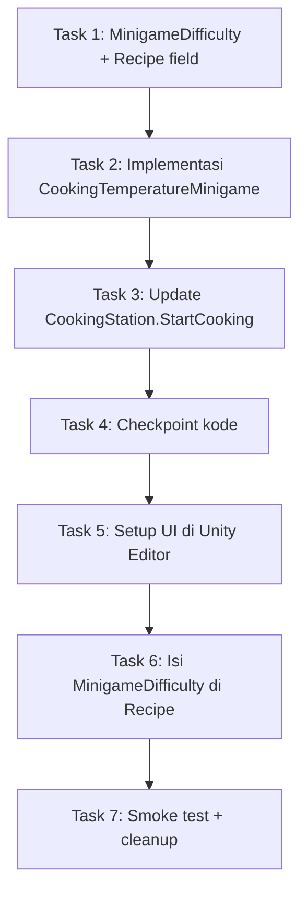

# Implementation Plan: Fishing Cooking Minigame

## Overview

Rencana implementasi mengganti minigame "shakey-wakey + suhu" lama dengan minigame mancing bergaya Stardew Valley. Pendekatan: ubah satu-per-satu agar project tetap kompilasi di setiap tahap.

Urutan eksekusi:
1. Tambah model data (`MinigameDifficulty`) dan field di `Recipe`.
2. Ganti isi `CookingTemperatureMinigame.cs` (logika minigame baru + helper pure `MinigamePure`).
3. Update satu baris di `CookingStation.StartCooking` agar memakai overload baru.
4. **(Manual di Unity Editor — user)** Setup hierarki UI + assign field Inspector.
5. **(Manual di Unity Editor — user)** Isi `minigameDifficulty` di salah satu Recipe sebagai contoh.
6. Smoke test manual + cleanup referensi field lama.
7. *(Opsional)* EditMode property tests untuk `MinigamePure`.

Catatan untuk pemula Unity: task bertanda **"[UNITY EDITOR]"** dikerjakan di dalam Unity Editor (Hierarchy/Inspector/Scene), bukan di file `.cs`. Task tanpa tanda itu murni edit kode.

## Tasks

- [x] 1. Tambahkan model `MinigameDifficulty` dan field di `Recipe`
  - [x] 1.1 Buat file baru `Assets/Script/Cooking/MinigameDifficulty.cs`
    - Buat class `[System.Serializable] public class MinigameDifficulty` (BUKAN MonoBehaviour, BUKAN ScriptableObject) di file sendiri agar mudah ditemukan dan tidak menumpuk di file `CookingTemperatureMinigame.cs`.
    - Field publik sesuai design.md → bagian "MinigameDifficulty — public fields":
      - `[Range(0.05f, 0.9f)] public float catchBarSize;`
      - `public float targetSpeed;`
      - `public float progressGainRate;`
      - `public float progressLossRate;`
      - `public float gravity;`
      - `public float pushForce;`
      - `public float minIdleTime;`
      - `public float maxIdleTime;`
    - Tidak perlu method apa pun di kelas ini; ini cuma "struct data" yang Unity dapat serialize ke Inspector.
    - _Requirements: 7.1, 7.4_

  - [x] 1.2 Tambah field `minigameDifficulty` di `Assets/Script/Cooking/Recipe.cs`
    - Tambahkan blok berikut tepat sebelum penutup class `Recipe`:
      ```csharp
      [Header("Cooking Minigame Difficulty")]
      public MinigameDifficulty minigameDifficulty;
      ```
    - Letakkan di bawah header `"Description"` agar terlihat di paling bawah Inspector Recipe (urutan UX yang lebih nyaman).
    - Tidak ada perubahan method publik di `Recipe`. ScriptableObject existing tetap valid; field baru terisi default Unity (semua nol) sampai designer mengisinya.
    - _Requirements: 7.1, 9.1, 9.2_

  - [x] 1.3 Verifikasi project kompilasi bersih
    - Buka Unity, tunggu re-compile selesai.
    - Pastikan tidak ada error merah di Console.
    - Jika muncul error tentang script lama (`CookingTemperatureMinigame` belum diubah), itu wajar karena belum disentuh di Task 1; lanjut ke Task 2.
    - _Requirements: 9.1, 9.2_

- [x] 2. Implementasi ulang `CookingTemperatureMinigame` (ganti isi file)
  - [x] 2.1 Hapus seluruh isi field lama yang tidak dipakai
    - Buka `Assets/Script/Cooking/CookingTemperatureMinigame.cs`.
    - Hapus seluruh field yang tidak dipakai oleh design baru: `temperatureSlider`, `progressSlider` (nama lama), `statusText`, `temperatureFill`, `maxTemperature`, `temperatureDropRate`, `mouseSensitivity`, `coldZoneMax`, `safeZoneMax`, `hotZoneMax`, `targetProgress`, `safeZoneSpeed`, `hotZoneSpeed`, `overHeatTimeLimit`, `coldColor`, `safeColor`, `hotColor`, `overheatColor`, `currentTemp`, `overHeatTimer`.
    - **PERTAHANKAN**: nama class `CookingTemperatureMinigame`, path file `Assets/Script/Cooking/CookingTemperatureMinigame.cs`, dan signature publik `void StartMinigame(CookingStation station)` agar prefab/scene yang sudah me-reference komponen ini tetap valid.
    - _Requirements: 9.1, 9.2, 9.3_

  - [x] 2.2 Tambah field UI baru sesuai design
    - Tambahkan field publik berikut di `CookingTemperatureMinigame` (lihat design.md → "Components and Interfaces" tabel public API):
      - `public RectTransform verticalBar;`
      - `public RectTransform catchBar;`
      - `public RectTransform target;`
      - `public Slider progressBar;`
      - `public UIAnimator uiAnimator;`
      - `public MinigameDifficulty defaultDifficulty;`
      - `public Sprite targetIcon;` *(opsional, boleh ditunda kalau belum punya sprite)*
    - Beri header Inspector yang jelas: `[Header("UI References")]`, `[Header("Difficulty (fallback if Recipe has none)")]`, dst.
    - Pakai `using UnityEngine.UI;` untuk `Slider`. Hapus `using TMPro;` jika tidak dipakai lagi.
    - _Requirements: 8.1, 8.2, 8.3, 8.4, 8.5_

  - [x] 2.3 Implementasi static helper `MinigamePure` (logika murni)
    - Di file yang sama (`CookingTemperatureMinigame.cs`), tambahkan `internal static class MinigamePure` di luar class `CookingTemperatureMinigame`.
    - Implementasikan method-method berikut sesuai pseudocode di design.md → "Algoritma Utama" dan "Testability":
      - `public static (float pos, float vel) IntegrateCatchBar(float pos, float vel, float accel, float dt, float lo, float hi)` — semi-implicit Euler: `vel' = vel + accel*dt`; `pos' = pos + vel'*dt`; lalu clamp `pos'` ke `[lo, hi]` dan jika menyentuh batas → `vel' = 0`.
      - `public static bool IsTargetInsideCatchBar(float targetY, float catchBarPosY, float catchBarHeight)` — return true jika `targetY ∈ [catchBarPosY - catchBarHeight/2, catchBarPosY + catchBarHeight/2]`.
      - `public static float StepProgress(float currentProgress, bool inside, float gainRate, float lossRate, float dt)` — gain saat inside, loss saat tidak inside, lalu `Mathf.Clamp(... , 0f, 100f)`.
      - `public static float StepTargetTowardsGoal(float targetPosY, float targetGoalPosY, float targetSpeed, float dt)` — pindahkan target ke goal sejauh `min(|goal - pos|, targetSpeed*dt)`; jika sudah cukup dekat, snap ke goal.
    - Method-method ini TIDAK boleh menyentuh `Time`, `Input`, `RectTransform`, atau `UnityEngine.Random`. Murni input → output.
    - _Requirements: 2.1, 2.2, 2.3, 2.4, 2.5, 3.2, 4.1, 4.2, 4.3_

  - [x] 2.4 Implementasi `StartMinigame` (overload lama + overload baru)
    - Implementasi overload baru `public void StartMinigame(CookingStation station, Recipe recipe)` sesuai design.md → "StartMinigame ... overload baru":
      - Set `currentStation = station`.
      - Set `activeDifficulty = ResolveDifficulty(recipe)`.
      - Set `isPlaying = true`, `currentProgress = 50f`.
      - Panggil `Canvas.ForceUpdateCanvases()` agar layout pasti sudah dihitung sebelum membaca height.
      - Hitung `barHeight = verticalBar.rect.height` dan `catchBarHeight = activeDifficulty.catchBarSize * barHeight`.
      - Set `catchBarPosY = barHeight / 2f`, `catchBarVelY = 0f`, `targetPosY = barHeight / 2f`, `targetGoalPosY = targetPosY`, `targetIdleTimer = Random.Range(activeDifficulty.minIdleTime, activeDifficulty.maxIdleTime)`.
      - Panggil `ApplyCatchBarHeight()` untuk men-set `catchBar.sizeDelta.y = catchBarHeight`.
      - Panggil `SyncUI()` agar UI awal konsisten.
      - Show panel: `if (uiAnimator != null) uiAnimator.ShowInstant(); else gameObject.SetActive(true);`.
      - Tambahkan guard error sesuai design.md → "Error Handling": null-check `verticalBar`/`catchBar`/`target` (Debug.LogError + EndMinigame(false)); jika `barHeight <= 0` → Debug.LogWarning + EndMinigame(false).
    - Implementasi fallback `public void StartMinigame(CookingStation station)` cukup memanggil `StartMinigame(station, null)`.
    - _Requirements: 1.1, 1.2, 1.3, 1.4, 1.5, 1.6, 7.2, 7.3, 9.3_

  - [x] 2.5 Implementasi `Update`, `HandleInput`, `UpdateTarget`, `UpdateProgress`, `SyncUI`
    - `void Update()` mengikuti pseudocode design: jika `!isPlaying` return; lalu `HandleInput(dt)` → `UpdateTarget(dt)` → `UpdateProgress(dt)` → `SyncUI()`.
    - `HandleInput(float dt)`:
      - `accel = Input.GetMouseButton(0) ? activeDifficulty.pushForce : -activeDifficulty.gravity;`
      - Panggil `MinigamePure.IntegrateCatchBar(catchBarPosY, catchBarVelY, accel, dt, catchBarHeight/2f, barHeight - catchBarHeight/2f)` dan tulis hasilnya ke `catchBarPosY`, `catchBarVelY`.
    - `UpdateTarget(float dt)`:
      - Jika `targetIdleTimer > 0`, kurangi timer. Jika baru saja mencapai 0, panggil `targetGoalPosY = PickRandomGoal(targetPosY)` dan return.
      - Jika tidak idle: hitung `step = activeDifficulty.targetSpeed * dt`. Jika `Mathf.Abs(targetGoalPosY - targetPosY) <= step`, snap `targetPosY = targetGoalPosY` dan reset `targetIdleTimer = Random.Range(min, max)`. Else `targetPosY += Mathf.Sign(targetGoalPosY - targetPosY) * step`.
      - `targetPosY = Mathf.Clamp(targetPosY, 0f, barHeight)`.
    - `UpdateProgress(float dt)`:
      - `bool inside = MinigamePure.IsTargetInsideCatchBar(targetPosY, catchBarPosY, catchBarHeight);`
      - `currentProgress = MinigamePure.StepProgress(currentProgress, inside, activeDifficulty.progressGainRate, activeDifficulty.progressLossRate, dt);`
      - Jika `currentProgress >= 100f` → `EndMinigame(true)`. Else jika `currentProgress <= 0f` → `EndMinigame(false)`.
    - `SyncUI()`:
      - `catchBar.anchoredPosition = new Vector2(catchBar.anchoredPosition.x, catchBarPosY);`
      - `target.anchoredPosition   = new Vector2(target.anchoredPosition.x,   targetPosY);`
      - `if (progressBar != null) progressBar.value = currentProgress;`
    - _Requirements: 2.1, 2.2, 2.3, 2.4, 2.5, 3.1, 3.2, 3.3, 3.4, 4.1, 4.2, 4.3, 4.4, 8.2, 8.3, 8.4_

  - [x] 2.6 Implementasi helper `ResolveDifficulty`, `PickRandomGoal`, `ApplyCatchBarHeight`
    - `MinigameDifficulty ResolveDifficulty(Recipe recipe)`:
      - Jika `recipe != null` dan `recipe.minigameDifficulty != null` dan dianggap "valid" (`catchBarSize > 0 && targetSpeed > 0 && pushForce > 0`), return `recipe.minigameDifficulty`.
      - Else return `defaultDifficulty`.
    - `float PickRandomGoal(float currentY)`:
      - Loop max 5 kali: `goal = UnityEngine.Random.Range(0f, barHeight); if (Mathf.Abs(goal - currentY) > 0.05f * barHeight) return goal;`
      - Setelah 5 kali, return `goal` apa pun yang terakhir di-roll.
    - `void ApplyCatchBarHeight()`: `catchBar.sizeDelta = new Vector2(catchBar.sizeDelta.x, catchBarHeight);`
    - _Requirements: 3.1, 3.4, 7.2, 7.3, 8.2_

  - [x] 2.7 Implementasi `EndMinigame(bool success)`
    - `isPlaying = false`.
    - Hide panel: `if (uiAnimator != null) uiAnimator.HideInstant(); else gameObject.SetActive(false);`
    - Simpan `var finished = currentStation; currentStation = null;` (reset SEBELUM panggil callback agar reentrant-safe).
    - Jika `finished != null` panggil `finished.OnMinigameComplete(success);`. Jika null → `Debug.LogWarning("EndMinigame called without station")`.
    - _Requirements: 5.1, 5.2, 5.3, 6.1, 6.2, 6.3, 6.4_

  - [x] 2.8 Verifikasi compile dan tidak ada referensi field lama yang menggantung
    - Setelah save, kembali ke Unity dan tunggu re-compile.
    - Buka Console: tidak boleh ada error compile. Warning tentang field lama yang missing di prefab/scene akan dibersihkan di Task 6 (cleanup).
    - Cek di Inspector pada GameObject yang punya komponen `CookingTemperatureMinigame` (jika ada di scene) bahwa field-field lama (`Temperature Slider`, `Status Text`, dll.) sudah hilang dan field-field baru (`Vertical Bar`, `Catch Bar`, `Target`, `Progress Bar`, `Default Difficulty`, dst.) muncul.
    - _Requirements: 8.5, 9.1, 9.2_

  - [ ]* 2.9 Tulis EditMode property test untuk `MinigamePure.IntegrateCatchBar`
    - **Property 2: Integrasi numerik Catch_Bar (sebelum clamp)**
    - **Property 3: Clamp Catch_Bar pada batas**
    - **Property 10: Catch_Bar selalu di dalam Vertical_Bar untuk semua catchBarSize valid**
    - File: `Assets/Tests/EditMode/CookingMinigamePropertyTests.cs`. Pakai NUnit + library PBT (FsCheck atau CsCheck). Min 100 iterasi per property.
    - **Validates: Requirements 2.1, 2.2, 2.3, 2.4, 2.5, 7.4, 8.2**

  - [ ]* 2.10 Tulis EditMode property test untuk `MinigamePure.StepTargetTowardsGoal` & range invariant
    - **Property 4: Pemilihan goal Target dan invariant range**
    - **Property 5: Gerakan Target menuju goal dengan kecepatan terbatas**
    - **Property 6: idleTimer dalam rentang yang diatur** (test `PickRandomGoal` dan logika idle timer dengan deterministic Random seed jika perlu).
    - **Validates: Requirements 3.1, 3.2, 3.3, 3.4**

  - [ ]* 2.11 Tulis EditMode property test untuk `MinigamePure.StepProgress` dan kondisi akhir
    - **Property 7: Akumulasi dan invariant Progress**
    - **Property 8: Kondisi akhir minigame berdasarkan ambang Progress**
    - **Validates: Requirements 4.1, 4.2, 4.3, 5.1, 5.2**

  - [ ]* 2.12 Tulis EditMode unit test contoh-driven untuk lifecycle Unity-side
    - **Property 1: Inisialisasi posisi tengah** — verify setelah `StartMinigame`, `catchBarPosY == barHeight/2` dan `targetPosY == barHeight/2`.
    - **Property 9: Idempotensi setelah EndMinigame** — verify `Update()` setelah `EndMinigame` tidak mengubah state observable.
    - **Property 11: Resolusi sumber MinigameDifficulty** — verify `ResolveDifficulty(null)` → `defaultDifficulty`; recipe dengan field valid → `recipe.minigameDifficulty`; recipe dengan field "kosong" (semua 0) → `defaultDifficulty`.
    - Pakai mock `RectTransform` sederhana atau scene fixture minimal.
    - **Validates: Requirements 1.5, 1.6, 5.3, 6.4, 7.2, 7.3**

- [x] 3. Update `CookingStation.StartCooking` agar mem-passing recipe ke minigame
  - [x] 3.1 Ubah panggilan `StartMinigame` di `Assets/Script/Cooking/CookingStation.cs`
    - Cari baris (di method `StartCooking`):
      ```csharp
      temperatureMinigame.StartMinigame(this);
      ```
    - Ganti menjadi:
      ```csharp
      temperatureMinigame.StartMinigame(this, recipe);
      ```
    - Jangan ubah baris lain di method ini. Alur cooking, `pendingRecipe`, `pendingInventory`, dan visual feedback tetap.
    - _Requirements: 1.1, 7.2, 7.3, 9.3_

  - [x] 3.2 Verifikasi project kompilasi
    - Save, kembali ke Unity, tunggu re-compile.
    - Console bersih (tidak ada error merah).
    - _Requirements: 9.3_

- [x] 4. Checkpoint kode
  - Pastikan semua file `.cs` kompilasi tanpa error.
  - Jangan menjalankan Play Mode dulu — UI belum disetup, panel belum ada.
  - Lanjut ke Task 5 (setup UI manual di Editor).
  - _Requirements: 9.1, 9.2, 9.3_

- [ ] 5. **[UNITY EDITOR]** Setup hierarki UI minigame (manual, dikerjakan oleh user)
  > Task ini dikerjakan langsung di Unity Editor (Hierarchy + Inspector). Tidak ada file `.cs` yang diedit di task ini.
  > Pastikan scene yang dibuka adalah scene tempat `CookingStation` berada (atau scene "Game"-mu yang utama).

  - [~] 5.1 Buat root `CookingMinigameCanvas`
    - Di window **Hierarchy**: klik kanan di area kosong → **UI** → **Canvas**.
    - Rename Canvas tersebut menjadi `CookingMinigameCanvas`.
    - Pilih `CookingMinigameCanvas`. Di **Inspector**:
      - Komponen **Canvas**: `Render Mode` = **Screen Space - Overlay** (default).
      - Komponen **Canvas Scaler**: `UI Scale Mode` = **Scale With Screen Size**, `Reference Resolution` = `1920 x 1080`, `Screen Match Mode` = **Match Width Or Height**, `Match` = `0.5`.
    - **PENTING**: Catatan untuk Task 5.7 — komponen `CookingTemperatureMinigame` akan dipasang di GameObject `CookingMinigameCanvas` ini.
    - _Requirements: 8.1_

  - [~] 5.2 Buat `Panel` background gelap
    - Di Hierarchy: klik kanan `CookingMinigameCanvas` → **UI** → **Panel**. Otomatis terbuat anak `Panel`.
    - Pilih `Panel`. Di Inspector:
      - **RectTransform**: anchor preset = **Stretch full** (tahan **Alt** saat klik preset stretch full agar otomatis fill parent). `Left/Top/Right/Bottom` semuanya 0.
      - **Image** (komponen Panel): `Color` = hitam dengan alpha rendah, mis. `(0, 0, 0, 150)` (atau warna gelap pilihanmu, semi-transparan).
    - Panel ini fungsinya cuma sebagai latar gelap supaya minigame fokus. Tidak ada script yang ditambahkan di sini.
    - _Requirements: 8.1_

  - [~] 5.3 Buat `VerticalBar` (kolam minigame)
    - Di Hierarchy: klik kanan `Panel` → **UI** → **Image**. Rename menjadi `VerticalBar`.
    - Pilih `VerticalBar`. Di Inspector → **RectTransform**:
      - `Anchor Min` = `(0.5, 0)`
      - `Anchor Max` = `(0.5, 0)`
      - `Pivot` = `(0.5, 0)`
      - `Pos X` = `0`, `Pos Y` = `100` (geser sedikit dari bawah panel)
      - `Width` = `60`, `Height` = `500`
    - **Image** (komponen): `Color` = abu-abu gelap mis. `(40, 40, 40, 200)` agar terlihat seperti kolom track.
    - **CATATAN PENTING (anchor & pivot)**: konvensi anchor `(0.5, 0)` + pivot `(0.5, 0)` adalah persyaratan koordinat di design.md. Catch Bar dan Target dihitung relatif terhadap ini, jadi JANGAN diubah ke pivot tengah.
    - _Requirements: 8.1, 8.2, 8.3_

  - [~] 5.4 Buat `CatchBar` di dalam `VerticalBar`
    - Di Hierarchy: klik kanan `VerticalBar` → **UI** → **Image**. Rename menjadi `CatchBar`.
    - Pilih `CatchBar`. Di Inspector → **RectTransform**:
      - `Anchor Min` = `(0.5, 0)`
      - `Anchor Max` = `(0.5, 0)`
      - `Pivot` = `(0.5, 0.5)`
      - `Pos X` = `0`, `Pos Y` = `250` (placeholder; runtime akan men-set ke tengah otomatis)
      - `Width` = `50`, `Height` = `100` (tinggi placeholder; runtime akan override sesuai `catchBarSize`)
    - **Image**: `Color` = hijau mis. `(80, 220, 100, 200)`.
    - _Requirements: 8.2_

  - [~] 5.5 Buat `Target` di dalam `VerticalBar`
    - Di Hierarchy: klik kanan `VerticalBar` → **UI** → **Image**. Rename menjadi `Target`.
    - Pilih `Target`. Di Inspector → **RectTransform**:
      - `Anchor Min` = `(0.5, 0)`
      - `Anchor Max` = `(0.5, 0)`
      - `Pivot` = `(0.5, 0.5)`
      - `Pos X` = `0`, `Pos Y` = `250`
      - `Width` = `40`, `Height` = `40`
    - **Image** → `Source Image`: drag salah satu sprite ikon ikan / bahan masakan dari `Assets/Assets/...`. Jika belum punya sprite spesifik, biarkan default `UISprite` dan ubah `Color` mencolok (mis. kuning/oranye).
    - **PENTING urutan child**: `Target` harus berada **di bawah** `CatchBar` di Hierarchy (`Target` di-render di atas `CatchBar`) supaya target terlihat saat overlap. Jika urutannya salah, drag `Target` ke posisi paling bawah dalam children `VerticalBar`.
    - _Requirements: 8.3_

  - [~] 5.6 Buat `ProgressBar` (Slider vertikal) di samping `VerticalBar`
    - Di Hierarchy: klik kanan `Panel` (BUKAN VerticalBar) → **UI** → **Slider**. Rename menjadi `ProgressBar`.
    - Pilih `ProgressBar`. Di Inspector → **RectTransform**:
      - `Anchor Min` = `(0.5, 0)`, `Anchor Max` = `(0.5, 0)`, `Pivot` = `(0.5, 0)`
      - `Pos X` = `80` (di kanan VerticalBar), `Pos Y` = `100`
      - `Width` = `30`, `Height` = `500`
    - Komponen **Slider**:
      - `Direction` = **Bottom To Top**
      - `Min Value` = `0`
      - `Max Value` = `100`
      - `Whole Numbers` = unchecked
      - `Value` = `50`
      - `Interactable` = unchecked
    - Hapus `Handle Slide Area` dari child Slider (klik kanan child `Handle Slide Area` di Hierarchy → **Delete**) agar tidak terlihat handle yang bisa diseret.
    - Anak `Background` dan `Fill Area` → `Fill`: warnai sesuai selera (mis. Background abu, Fill hijau).
    - _Requirements: 8.4_

  - [~] 5.7 Tambah komponen `CookingTemperatureMinigame` ke `CookingMinigameCanvas`
    - Pilih `CookingMinigameCanvas` di Hierarchy.
    - Di Inspector klik **Add Component** → ketik `Cooking Temperature Minigame` → pilih komponen tersebut.
    - *(Opsional)* Klik **Add Component** lagi → ketik `UI Animator` → pilih komponen `UIAnimator` (kalau ingin animasi show/hide). Konfigurasikan animasinya sesuai selera.
    - _Requirements: 1.2, 1.3, 8.5_

  - [~] 5.8 Assign field di Inspector `CookingTemperatureMinigame`
    - Pilih `CookingMinigameCanvas`. Di Inspector, scroll ke komponen **Cooking Temperature Minigame**:
      - **Vertical Bar** ← drag GameObject `VerticalBar` dari Hierarchy.
      - **Catch Bar** ← drag GameObject `CatchBar` dari Hierarchy.
      - **Target** ← drag GameObject `Target` dari Hierarchy.
      - **Progress Bar** ← drag GameObject `ProgressBar` dari Hierarchy (Unity akan otomatis ambil komponen `Slider`).
      - **Ui Animator** ← drag GameObject `CookingMinigameCanvas` itu sendiri (komponen `UIAnimator` kalau dipasang). Boleh dikosongkan kalau tidak pakai animasi.
      - **Default Difficulty** (expand panah ▶ di kiri label):
        - `Catch Bar Size` = `0.20`
        - `Target Speed` = `250`
        - `Progress Gain Rate` = `25`
        - `Progress Loss Rate` = `20`
        - `Gravity` = `600`
        - `Push Force` = `1200`
        - `Min Idle Time` = `0.2`
        - `Max Idle Time` = `0.8`
      - **Target Icon** ← (opsional) sprite default ikon target.
    - _Requirements: 1.2, 1.3, 7.3, 8.5_

  - [~] 5.9 Assign `temperatureMinigame` di `CookingStation`
    - Buka scene/prefab yang punya `CookingStation` aktif (cari GameObject yang menyimpan komponen `CookingStation`).
    - Pilih GameObject `CookingStation`. Di Inspector → komponen **Cooking Station**:
      - **Temperature Minigame** ← drag GameObject `CookingMinigameCanvas` dari Hierarchy. Unity akan otomatis ambil komponen `CookingTemperatureMinigame` di GameObject tersebut.
    - Jika `CookingStation` tersimpan sebagai prefab dan reference cross-scene tidak diperbolehkan, pertimbangkan: (a) pindahkan `CookingMinigameCanvas` ke scene yang sama, atau (b) jadikan `CookingMinigameCanvas` sebagai prefab dan instance di scene yang sama dengan `CookingStation`.
    - _Requirements: 1.1, 9.3_

  - [~] 5.10 Set `CookingMinigameCanvas` inactive secara default
    - Pilih `CookingMinigameCanvas` di Hierarchy.
    - Di Inspector pojok kiri atas (sebelah nama GameObject), **un-check** checkbox aktif. GameObject menjadi abu-abu/tidak aktif.
    - Saat `CookingTemperatureMinigame.StartMinigame(...)` dipanggil, ia akan men-`SetActive(true)` (lewat fallback) atau `UIAnimator.ShowInstant()` (lewat animator). Saat `EndMinigame` dipanggil, ia akan menyembunyikannya kembali.
    - **CATATAN**: kalau `UIAnimator` butuh GameObject aktif untuk inisialisasi animasinya, baca dokumentasi internal `UIAnimator.cs`-mu. Untuk MVP, fallback `SetActive` cukup.
    - _Requirements: 1.2, 1.3, 6.2, 6.3_

  - [~] 5.11 Acceptance — verifikasi visual layout (tanpa Play Mode)
    - Di Scene view (atau Game view dengan canvas terlihat sementara aktif), pastikan layout terlihat masuk akal: VerticalBar muncul vertikal di tengah-bawah, ProgressBar di kanan VerticalBar, CatchBar berwarna hijau di tengah VerticalBar, Target ada di tengah VerticalBar.
    - Setelah verifikasi, kembalikan `CookingMinigameCanvas` ke inactive.
    - _Requirements: 8.1, 8.2, 8.3, 8.4_

- [ ] 6. **[UNITY EDITOR]** Isi `MinigameDifficulty` di salah satu Recipe sebagai contoh
  > Task ini dikerjakan di Unity Editor (Project window + Inspector).

  - [~] 6.1 Pilih satu Recipe untuk diisi
    - Di **Project** window, cari folder yang berisi Recipe ScriptableObject (umumnya `Assets/...` di mana `[CreateAssetMenu(... menuName = "Cooking/Recipe")]` di-instance). Bisa diketik `t:Recipe` di search bar Project window.
    - Pilih SATU Recipe sebagai contoh "resep sulit" atau "resep mudah" — pilihanmu.

  - [~] 6.2 Isi field `Minigame Difficulty` di Inspector
    - Di Inspector Recipe yang dipilih, scroll ke header **Cooking Minigame Difficulty**.
    - Expand `Minigame Difficulty` (klik panah ▶):
      - Untuk resep **lebih sulit**: `Catch Bar Size` = `0.15`, `Target Speed` = `350`, `Progress Gain Rate` = `20`, `Progress Loss Rate` = `25`, `Gravity` = `600`, `Push Force` = `1200`, `Min Idle Time` = `0.1`, `Max Idle Time` = `0.5`.
      - Untuk resep **lebih mudah**: `Catch Bar Size` = `0.30`, `Target Speed` = `180`, `Progress Gain Rate` = `30`, `Progress Loss Rate` = `15`, `Gravity` = `500`, `Push Force` = `1100`, `Min Idle Time` = `0.3`, `Max Idle Time` = `1.0`.
    - Save (Ctrl+S).
    - _Requirements: 7.1, 7.2_

  - [~] 6.3 Acceptance — verifikasi serialisasi
    - Klik di asset lain lalu kembali ke Recipe yang baru diisi. Nilai-nilainya harus tetap (bukan kembali ke 0).
    - _Requirements: 7.1_

- [ ] 7. **[UNITY EDITOR]** Smoke test manual di Play Mode + cleanup referensi lama
  > Mengikuti checklist Play Mode di design.md → Testing Strategy → "Manual / Play Mode smoke test" (6 langkah).

  - [~] 7.1 Smoke test #1 — panel muncul saat Cook
    - Tekan **Play** di Unity.
    - Dekati `CookingStation`, tekan tombol Interact untuk membuka `CookingUI`.
    - Pilih recipe yang sudah diisi `MinigameDifficulty` di Task 6, klik tombol Cook.
    - **Expected**: `CookingMinigameCanvas` muncul (panel gelap + VerticalBar + CatchBar + Target + ProgressBar terlihat).
    - _Requirements: 1.1, 1.2, 1.3_

  - [~] 7.2 Smoke test #2 — Catch Bar respons mouse kiri
    - Tahan klik kiri → `CatchBar` terdorong ke atas.
    - Lepas → `CatchBar` jatuh karena gravitasi.
    - `CatchBar` tidak boleh keluar dari `VerticalBar` (clamp jalan).
    - _Requirements: 2.1, 2.2, 2.3, 2.4, 2.5_

  - [~] 7.3 Smoke test #3 — Target bergerak acak
    - Target naik-turun secara acak; sesekali jeda diam beberapa saat.
    - Target tetap di dalam `VerticalBar`.
    - _Requirements: 3.1, 3.2, 3.3, 3.4_

  - [~] 7.4 Smoke test #4 — Progress berubah
    - Saat Target di dalam range CatchBar → `ProgressBar` naik.
    - Saat Target di luar range CatchBar → `ProgressBar` turun.
    - _Requirements: 4.1, 4.2, 4.3, 4.4_

  - [~] 7.5 Smoke test #5 — kondisi menang
    - Tahan Target di dalam CatchBar sampai progress 100.
    - **Expected**: panel `CookingMinigameCanvas` hilang, log `"Temperature Minigame berhasil! Lanjut ke Plating..."` muncul, alur Plating dimulai.
    - _Requirements: 5.1, 5.3, 6.1, 6.2, 6.3, 6.4_

  - [~] 7.6 Smoke test #6 — kondisi kalah
    - Ulangi dari awal, kali ini biarkan progress turun ke 0 (jangan tangkap target).
    - **Expected**: panel hilang, log `"Masakan GOSONG! Bahan terbuang!"` muncul, state kembali ke Idle.
    - _Requirements: 5.2, 5.3, 6.1, 6.2, 6.3, 6.4_

  - [~] 7.7 Cleanup referensi field lama yang missing di scene/prefab
    - Stop Play Mode.
    - Buka scene atau prefab apa pun yang dulu pernah meng-assign field lama (`Temperature Slider`, `Status Text`, `Temperature Fill`, `Progress Slider` lama, dll.). Field lama otomatis hilang dari Inspector setelah recompile, tapi GameObject UI lama (mis. `OldTemperatureBar`) mungkin masih ada di scene.
    - Hapus GameObject UI minigame lama yang tidak lagi dipakai (KONFIRMASI dulu sebelum menghapus, terutama jika GameObject tersebut juga dipakai oleh sistem lain).
    - Cari di Project → ketik `t:Prefab` dan periksa prefab terkait Cooking. Jika ada prefab dengan komponen `CookingTemperatureMinigame` versi lama dengan field-field yang sekarang missing, buka prefab dan apply ulang sesuai struktur baru di Task 5 (atau hapus prefab lama jika tidak terpakai).
    - _Requirements: 9.1, 9.2_

  - [~] 7.8 Final acceptance
    - Semua 6 langkah smoke test (7.1 – 7.6) berhasil.
    - Console bersih dari error.
    - Tidak ada warning "missing reference" yang berkaitan dengan minigame baru.
    - _Requirements: 1.1, 2.1, 3.1, 4.1, 5.1, 5.2, 6.1, 8.1, 9.1, 9.2, 9.3_

## Task Dependency Graph



Wave definitions (eksekusi strictly sekuensial — tiap task tergantung pada task sebelumnya):

```json
{
  "waves": [
    { "wave": 1, "tasks": ["1"] },
    { "wave": 2, "tasks": ["2"] },
    { "wave": 3, "tasks": ["3"] },
    { "wave": 4, "tasks": ["4"] },
    { "wave": 5, "tasks": ["5"] },
    { "wave": 6, "tasks": ["6"] },
    { "wave": 7, "tasks": ["7"] }
  ]
}
```

Catatan dependency:

- Task 2 bergantung pada Task 1 karena `CookingTemperatureMinigame` me-reference `MinigameDifficulty` dan `Recipe.minigameDifficulty`.
- Task 3 bergantung pada Task 2 karena overload `StartMinigame(CookingStation, Recipe)` baru ada setelah Task 2.
- Task 5 (UI Unity) bergantung pada Task 4 karena Inspector hanya akan menampilkan field-field baru setelah kode kompilasi bersih.
- Task 6 bergantung pada Task 5 karena verifikasi pengisian Recipe paling natural dilakukan setelah panel UI ada (tetapi field `minigameDifficulty` di Recipe sudah bisa diisi sejak Task 1.2 — Task 6 fokus pada nilai contoh + pengetesan integrasi).
- Task 7 bergantung pada semua task sebelumnya — Play Mode test hanya valid setelah kode + UI + data Recipe siap.

## Notes

- Sub-tasks bertanda `*` (Task 2.9 – 2.12) adalah opsional dan dapat dilewati untuk MVP. Sub-tasks itu adalah **EditMode property tests** (Properties P1–P11 dari design.md). Disarankan dikerjakan setelah implementasi stabil agar regresi pada `MinigamePure` tertangkap di CI.
- Task bertanda **[UNITY EDITOR]** (Task 5, 6, 7) **HARUS dikerjakan oleh user secara manual** di dalam Unity Editor. Sub-agent task-execution tidak akan mengeksekusi task-task ini karena memerlukan interaksi GUI (Hierarchy, Inspector, Play Mode).
- Task tanpa tanda khusus (Task 1, 2, 3, 4) adalah **task kode** murni dan dapat dieksekusi oleh sub-agent task-execution.
- Setiap task di-mapping ke Requirements R1–R9 untuk traceability.

## Ringkasan eksekusi

- **Task kode (sub-agent / agent)**: 1, 2 (kecuali sub-tasks `*` opsional), 3, 4. Total ~12 sub-tasks wajib + 4 sub-tasks `*` opsional.
- **Task manual (user di Unity Editor)**: 5 (11 sub-tasks setup UI), 6 (3 sub-tasks isi Recipe), 7 (8 sub-tasks smoke test + cleanup). Total ~22 sub-tasks manual.
- **Total task top-level**: 7.
